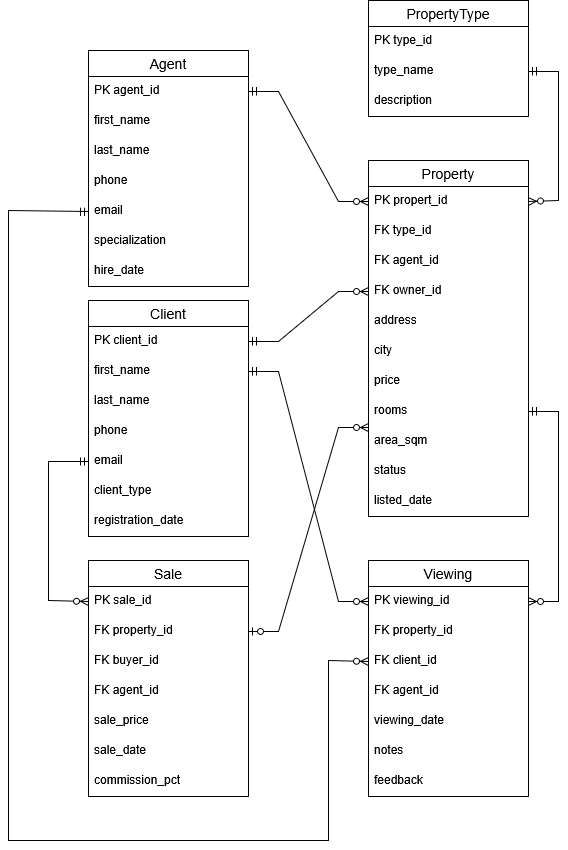

# Звіт з КР з Організації Баз Даних

## 1. Проєктування схеми

## ER-діаграма


Схема побудована на основі ER-діаграми. Для забезпечення цілісності використані первинні та зовнішні ключі (`PRIMARY KEY`, `REFERENCES`).

```sql
SET search_path TO kr;

CREATE TYPE client_type_enum AS ENUM ('покупець', 'продавець');
CREATE TYPE property_status_enum AS ENUM ('доступна', 'зарезервована', 'продана');

CREATE TABLE property_type (
    type_id SERIAL PRIMARY KEY,
    type_name VARCHAR(50) UNIQUE NOT NULL,
    description TEXT
);

CREATE TABLE agents (
    agent_id SERIAL PRIMARY KEY,
    first_name VARCHAR(50) NOT NULL,
    last_name VARCHAR(50) NOT NULL,
    phone VARCHAR(20),
    email VARCHAR(100) UNIQUE,
    specialization VARCHAR(100),
    hire_date DATE DEFAULT CURRENT_DATE
);

CREATE TABLE clients (
    client_id SERIAL PRIMARY KEY,
    first_name VARCHAR(50) NOT NULL,
    last_name VARCHAR(50) NOT NULL,
    phone VARCHAR(20),
    email VARCHAR(100) UNIQUE,
    client_type client_type_enum NOT NULL,
    registration_date DATE DEFAULT CURRENT_DATE
);

CREATE TABLE properties (
    property_id SERIAL PRIMARY KEY,
    type_id INT REFERENCES property_type(type_id),
    agent_id INT REFERENCES agents(agent_id),
    owner_id INT REFERENCES clients(client_id),
    address VARCHAR(255) NOT NULL,
    city VARCHAR(100),
    price NUMERIC(12, 2) NOT NULL,
    rooms SMALLINT NOT NULL CHECK (rooms > 0),
    area_sqm NUMERIC(10, 2),
    status property_status_enum DEFAULT 'доступна',
    listed_date DATE NOT NULL DEFAULT CURRENT_DATE
);

CREATE TABLE viewings (
    viewing_id SERIAL PRIMARY KEY,
    property_id INT REFERENCES properties(property_id) ON DELETE CASCADE,
    client_id INT REFERENCES clients(client_id),
    agent_id INT REFERENCES agents(agent_id),
    viewing_date TIMESTAMP NOT NULL,
    notes TEXT,
    feedback TEXT
);

CREATE TABLE sales (
    sale_id SERIAL PRIMARY KEY,
    property_id INT UNIQUE REFERENCES properties(property_id),
    buyer_id INT REFERENCES clients(client_id),
    agent_id INT REFERENCES agents(agent_id),
    sale_price NUMERIC(12, 2) NOT NULL,
    sale_date DATE NOT NULL DEFAULT CURRENT_DATE,
    commission_pct NUMERIC(4, 2)
);

-- Таблиця транзакцій продажу
CREATE TABLE sales (
    sale_id SERIAL PRIMARY KEY,
    property_id INT UNIQUE REFERENCES properties(property_id),
    buyer_id INT REFERENCES clients(client_id),
    agent_id INT REFERENCES agents(agent_id),
    sale_price NUMERIC(15, 2) NOT NULL,
    sale_date DATE NOT NULL DEFAULT CURRENT_DATE,
    commission_pct NUMERIC(4, 2)
);
```
## 2. Операції маніпулювання даними (OLTP)

Нижче наведено приклади базових операцій: додавання, оновлення, видалення та пошуку даних.

## 2.1. Додавання даних (INSERT)

```sql
-- Додавання типів та персоналу
INSERT INTO property_type (type_name, description)
VALUES ('Квартира', 'Житлове приміщення у багатоквартирному будинку');

INSERT INTO agents (first_name, last_name, phone, email, specialization, hire_date)
VALUES ('Петро', 'Шевченко', '+380501112299', 'petro.sh@example.com', 'Житлова нерухомість', CURRENT_DATE);

INSERT INTO clients (first_name, last_name, phone, email, client_type, registration_date)
VALUES ('Олексій', 'Коваленко', '+380631112299', 'oleksiy.k@example.com', 'продавець', CURRENT_DATE),
       ('Марія', 'Ткачук', '+380671112299', 'maria.t@example.com', 'покупець', CURRENT_DATE);

INSERT INTO properties (type_id, agent_id, owner_id, address, city, price, rooms, area_sqm, status, listed_date)
VALUES (1, 1, 1, 'вул. Хрещатик, 10', 'Київ', 150000.00, 3, 85.50, 'доступна', CURRENT_DATE);

INSERT INTO viewings (property_id, client_id, agent_id, viewing_date, notes, feedback)
VALUES (1, 2, 1, '2026-04-01 14:00:00', 'Перший огляд обєкта', 'Світла кімната');

INSERT INTO sales (property_id, buyer_id, agent_id, sale_price, sale_date, commission_pct)
VALUES (1, 2, 1, 145000.00, CURRENT_DATE, 5.00);
```
## 2.2. Оновлення та видалення (UPDATE / DELETE)
```sql
UPDATE properties
SET price = price * 0.90
WHERE status = 'доступна' AND listed_date < CURRENT_DATE - INTERVAL '6 months';

UPDATE viewings
SET feedback = 'Замала кухня'
WHERE viewing_id = 1;


DELETE FROM viewings
WHERE viewing_date < CURRENT_DATE AND notes IS NULL AND feedback IS NULL;

DELETE FROM clients
WHERE email IS NULL AND phone IS NULL;
```
## 2.3. Прості вибірки (SELECT)
```sql
SELECT property_id, address, city, price, status
FROM properties
WHERE agent_id = 1;

SELECT v.viewing_date, c.first_name AS client_first, c.last_name AS client_last, v.feedback
FROM viewings v
JOIN clients c ON v.client_id = c.client_id
WHERE v.property_id = 1
ORDER BY v.viewing_date DESC;
```
## 3. Аналітичні запити (OLAP)

Використання агрегатних функцій, групування та спільних табличних виразів для аналізу бізнес-показників.
```sql
SELECT pt.type_name, ROUND(AVG(s.sale_price), 2) AS avg_sale_price
FROM sales s
JOIN properties p ON s.property_id = p.property_id
JOIN property_type pt ON p.type_id = pt.type_id
GROUP BY pt.type_name;

SELECT a.first_name, a.last_name, COUNT(s.sale_id) AS total_sales
FROM sales s
JOIN agents a ON s.agent_id = a.agent_id
WHERE s.sale_date >= CURRENT_DATE - INTERVAL '1 year'
GROUP BY a.agent_id, a.first_name, a.last_name
ORDER BY total_sales DESC;

SELECT ROUND(AVG(s.sale_date - p.listed_date), 0) AS avg_days_on_market
FROM sales s
JOIN properties p ON s.property_id = p.property_id;

WITH viewing_stats AS (
    SELECT property_id, COUNT(*) AS view_count
    FROM viewings
    GROUP BY property_id
    HAVING COUNT(*) > 0
)
SELECT p.address, p.city, p.price, vs.view_count
FROM properties p
JOIN viewing_stats vs ON p.property_id = vs.property_id
LEFT JOIN sales s ON p.property_id = s.property_id
WHERE s.sale_id IS NULL AND p.status = 'доступна';
```
